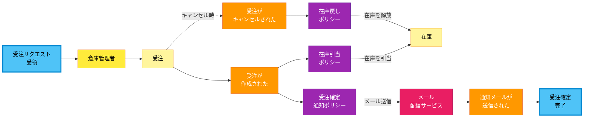

# Setup

1.  **Set `commandName`**: `show-event`
2.  **Set `baseDir`**: `.teamkit`
3.  **Get `specDir`**: Read the first argument passed to the slash command.
    -   If no argument is provided, display the error message: "Error: `specDir` argument is required. Usage: `/generate-eventstorming <specDir>`" and **STOP** execution immediately.

# Execution

Execute the following instructions using `baseDir` and `specDir`.

**IMPORTANT**:
-   All output to the user (status messages, completion notifications) must be in **Japanese**.
-   The content of the generated Mermaid diagram must be in **Japanese**.
-   Do not ask for user confirmation before saving files.
-   **Do NOT use SlashCommand tool to call other teamkit commands.** Execute all logic directly within this command.

---

# Event Storming Diagram Generation Command

## Purpose
Read `workflow.yml` and generate a Mermaid diagram (graph LR) that visualizes Event Storming as a **horizontal timeline flow** from start to end:
- Shows the business process flow from left to right
- Events (イベント) are placed on the flow timeline
- Actors (アクター) are placed above/below the events they trigger
- External Systems (外部システム) are placed where they interact
- Aggregates (集約) are shown as yellow rectangles
- Policies (ポリシー) connect events to subsequent actions
- Pivotal Events (重要イベント) are highlighted

The diagram is optimized for pasting into Miro's Mermaid app and follows the Event Storming "Big Picture" style.

## Execution Steps

### 1. Pre-check: workflow.yml
- **Target File**: `{{baseDir}}/{{specDir}}/workflow.yml`
- **Action**:
  - If the file exists → Proceed to Step 2.
  - If the file does not exist → Display the message "エラー: `workflow.yml` が存在しません。先に `/teamkit:generate-workflow` を実行してください。" and **STOP** execution immediately.

### 2. Read Input
- Read `{{baseDir}}/{{specDir}}/workflow.yml`.
- Parse the YAML structure to extract:
  - `actor` - List of actors with name and description
  - `external_system` - List of external systems with name and description
  - `aggregate` - List of aggregate names
  - `feature` - List of features containing:
    - `name` - Feature name
    - `events` - List of domain events
    - `policy` - List of policies with trigger and action

### 3. Generate Mermaid Diagram

Generate a Mermaid diagram as a **horizontal timeline flow** (NOT grouped by category).

**CRITICAL DESIGN PRINCIPLES**:
1. **NO subgraph grouping by element type** - Do NOT group all actors, all events, etc. into separate subgraphs
2. **Timeline flow from left to right** - Events flow chronologically as a business process
3. **Actors placed contextually** - Each actor appears near the events/aggregates they interact with
4. **External systems inline** - External systems appear where they are called in the flow
5. **Aggregates as process states** - Aggregates appear as yellow boxes showing entity state changes

```mermaid
graph LR
    %% ===== スタイル定義 =====
    classDef actor fill:#ffeb3b,stroke:#f57f17,color:#000
    classDef external fill:#e91e63,stroke:#880e4f,color:#fff
    classDef aggregate fill:#fff59d,stroke:#f9a825,color:#000
    classDef event fill:#ff9800,stroke:#e65100,color:#fff
    classDef policy fill:#9c27b0,stroke:#6a1b9a,color:#fff
    classDef pivotal fill:#4fc3f7,stroke:#0288d1,color:#000,stroke-width:3px
    classDef note fill:#fff9c4,stroke:#f9a825,color:#000

    %% ===== 開始イベント（Pivotal Event） =====
    START[開始イベント]:::pivotal

    %% ===== フェーズ1: 最初の処理 =====
    A1[アクター1]:::actor
    AGG1[集約1]:::aggregate
    EV1[イベント1が発生した]:::event

    START --> A1
    A1 --> AGG1
    AGG1 --> EV1

    %% ===== 分岐処理 =====
    EV1 --> EV2a[条件Aの場合]:::event
    EV1 --> EV2b[条件Bの場合]:::event

    %% ===== ポリシーによる自動処理 =====
    EV2a --> POL1[ポリシー1]:::policy
    POL1 --> EXT1[外部システム1]:::external
    EXT1 --> EV3[通知が送信された]:::event

    %% ===== 終了イベント（Pivotal Event） =====
    EV3 --> END[終了イベント]:::pivotal
```



**Diagram Generation Rules**:

1. **Node ID Naming Convention**:
   - Pivotal Events: `PIV_{{name}}` (e.g., `PIV_Start`, `PIV_End`)
   - Actors: `A_{{name}}` (e.g., `A_ブローカー`, `A_アンダーライター`)
   - External Systems: `EXT_{{name}}` (e.g., `EXT_ECM`, `EXT_Rater`)
   - Aggregates: `AGG_{{name}}` (e.g., `AGG_受注`, `AGG_在庫`)
   - Events: `EV_{{shortName}}` (e.g., `EV_更新トリガー`, `EV_見積作成`)
   - Policies: `POL_{{name}}` (e.g., `POL_自動通知`)

2. **Layout Structure (Left to Right Timeline)**:
   - Start with a Pivotal Event marking the process beginning
   - Flow through events chronologically based on feature order
   - Place actors ABOVE or connected to the aggregates/events they interact with
   - Place external systems where they are invoked in the flow
   - End with a Pivotal Event marking the process completion
   - Show branches/forks where the process can take different paths

3. **Flow Connection Patterns**:
   - `Actor --> Aggregate` - Actor performs action on aggregate
   - `Aggregate --> Event` - Aggregate state change triggers event
   - `Event --> Policy` - Event triggers a policy
   - `Policy --> External System` - Policy invokes external system
   - `Policy --> Aggregate` - Policy updates another aggregate
   - `External System --> Event` - External system action produces event
   - `Event --> Event` (branching) - Process branches based on conditions

4. **Visual Hierarchy**:
   - **Pivotal Events** (blue, thick border): Mark major milestones (start, end, key decision points)
   - **Events** (orange): Domain events in past tense
   - **Actors** (yellow): People/roles who trigger actions
   - **Aggregates** (light yellow): Entity states
   - **Policies** (purple): Automated reactions to events
   - **External Systems** (pink): External integrations

5. **Branching and Merging**:
   - Show decision points where flow branches (e.g., 損失あり vs 損失なし)
   - Use descriptive labels on branches
   - Flows can merge back together at later events

6. **Comments/Notes** (Optional):
   - Add explanatory notes using `NOTE_{{id}}[説明文]:::note` style
   - Connect notes with dotted lines: `NOTE_1 -.-> EV1`

### 4. Analyze Business Flow

Analyze the workflow.yml to determine the **chronological business process**:

1. **Identify Start Point**: What event initiates the entire process?
2. **Trace Feature Sequence**: Order features by their logical sequence in the business process
3. **Map Decision Points**: Identify where the flow branches (e.g., approval/rejection, with-loss/without-loss)
4. **Identify End Points**: What event(s) mark completion?

**Flow Analysis Steps**:
1. Find the triggering event (often in the first feature)
2. Follow each event → policy → action chain
3. Identify which actors are involved at each step
4. Note where external systems are called
5. Mark pivotal events (major milestones)
6. Show the complete flow with branches

### 5. Save File
- Save the generated Mermaid diagram as `{{baseDir}}/{{specDir}}/eventstorming.md`
- The file should contain:
  1. A header with scenario info
  2. The Mermaid code block
  3. A legend explaining the symbols
  4. Optional notes section for additional context

**Output File Format**:

```markdown
# Event Storming Diagram - {{specDir}}

## シナリオ概要
- **シナリオ**: [プロセス名を記載]
- **開始**: [開始イベント]
- **終了**: [終了イベント]

## 概要
このドキュメントは `workflow.yml` から自動生成された Event Storming 図です。
業務フローを時系列で左から右に表現しています。

## Event Storming 図

\`\`\`mermaid
graph LR
    ... (generated diagram content)
\`\`\`

## 凡例

| 色 | 要素 | 説明 |
|----|------|------|
| 🔵 青（太枠） | Pivotal Event | プロセスの重要なマイルストーン |
| 🟧 オレンジ | イベント | 発生した事実（ドメインイベント） |
| 🟨 黄色 | アクター | システムを操作する人・役割 |
| 🟨 薄黄色 | 集約 | ドメインエンティティの状態 |
| 🟪 紫 | ポリシー | イベントに反応する自動処理 |
| 🩷 ピンク | 外部システム | 連携する外部サービス |

## 注釈

[各外部システムや特殊な処理についての説明をここに記載]
```

### 6. Completion
- Display completion message: "Event Storming 図の生成が完了しました: `{{baseDir}}/{{specDir}}/eventstorming.md`"
- Display summary:
  - Scenario name (シナリオ名)
  - Start event (開始イベント)
  - End event (終了イベント)
  - Number of actors
  - Number of external systems
  - Number of aggregates
  - Number of events
  - Number of policies
  - Number of pivotal events

## Example

### Input (workflow.yml)
```yaml
actor:
  - name: 倉庫管理者
    description: 受注処理と在庫管理を担当する責任者

external_system:
  - name: メール配信サービス
    description: 顧客への通知メールを送信する

aggregate:
  - 受注
  - 在庫

feature:
  - name: 受注の作成・編集・キャンセル
    description: 受注を管理する機能
    events:
      - 受注が作成された
      - 受注がキャンセルされた
    policy:
      - name: 在庫引当ポリシー
        trigger: 受注が作成された
        action: 在庫を自動的に引き当てる
      - name: 在庫戻しポリシー
        trigger: 受注がキャンセルされた
        action: 在庫を解放する

  - name: 顧客への自動通知
    description: 顧客にメール通知を送信する
    events:
      - 通知メールが送信された
    policy:
      - name: 受注確定通知ポリシー
        trigger: 受注が作成された
        action: 確認メールを送信する
```

### Output (eventstorming.md)

````markdown
# Event Storming Diagram - order-management

## シナリオ概要
- **シナリオ**: 受注処理フロー
- **開始**: 受注リクエスト受領
- **終了**: 受注確定通知送信完了

## 概要
このドキュメントは `workflow.yml` から自動生成された Event Storming 図です。
業務フローを時系列で左から右に表現しています。


## Event Storming 図



## 凡例

| 色 | 要素 | 説明 |
|----|------|------|
| 🔵 青（太枠） | Pivotal Event | プロセスの重要なマイルストーン |
| 🟧 オレンジ | イベント | 発生した事実（ドメインイベント） |
| 🟨 黄色 | アクター | システムを操作する人・役割 |
| 🟨 薄黄色 | 集約 | ドメインエンティティの状態 |
| 🟪 紫 | ポリシー | イベントに反応する自動処理 |
| 🩷 ピンク | 外部システム | 連携する外部サービス |

## 注釈

- **メール配信サービス**: 顧客への通知メールを送信する外部サービス
- **キャンセルフロー**: 点線で表示。通常フローからの分岐を示す
````

## Notes
-   **No User Confirmation**: This command is fully automated.
-   **Japanese Output**: All diagram content should be in Japanese.
-   **Timeline Flow**: Generate as a left-to-right business process flow, NOT grouped by element type.
-   **Pivotal Events**: Mark the start and end of the process, plus major decision points.
-   **No SlashCommand Calls**: Do not call other slash commands. Execute all logic directly.
-   **Line Breaks in Labels**: Use `<br>` for multi-line labels to improve readability.
